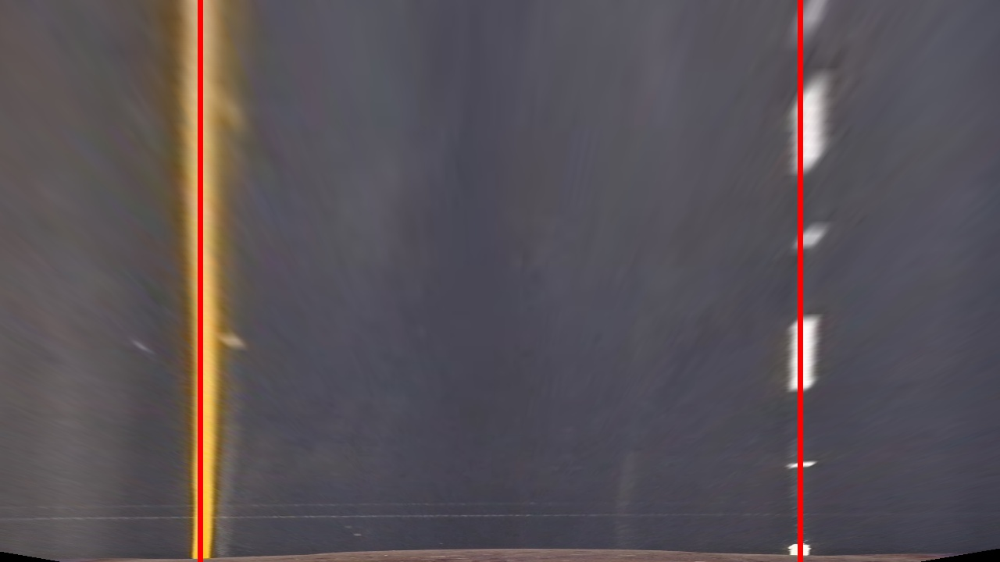
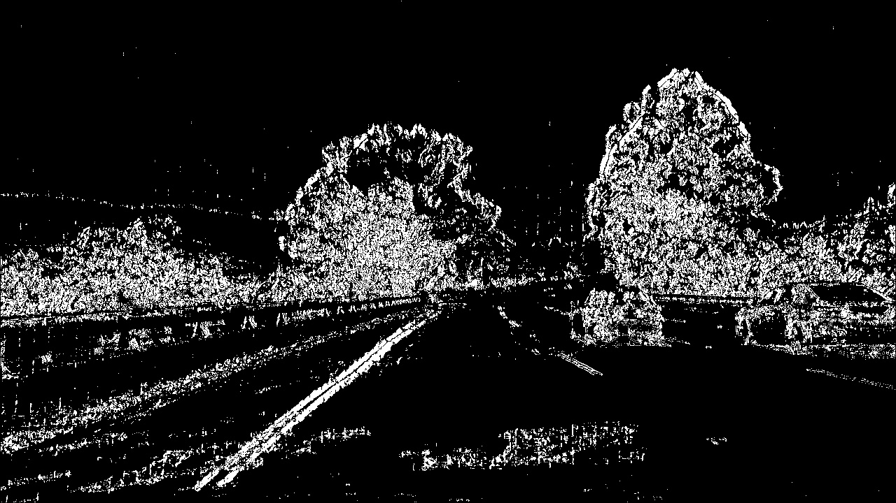
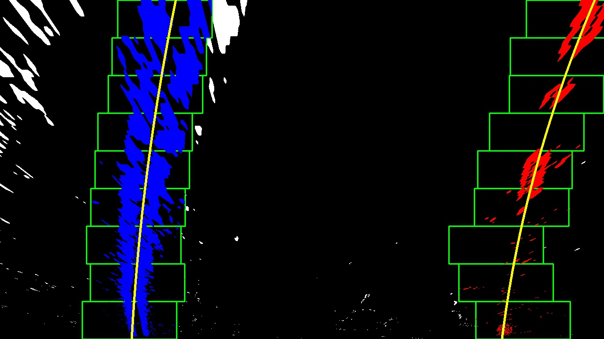
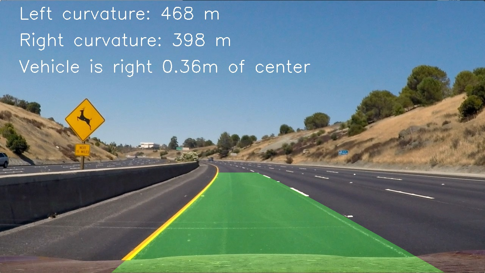

# Advanced Lane Finding
[](http://www.udacity.com/drive)


This project is to write a software pipeline to identify the lane boundaries in a video. It used  camera calibration, color transform, gradient edge detection, perspective tranform, and curvature fitting to find the lane boundary.    

## Project Goal

The goals / steps of this project are the following:

* Compute the camera calibration matrix and distortion coefficients given a set of chessboard images.
* Apply a distortion correction to raw images.
* Use color transforms, gradients, etc., to create a thresholded binary image.
* Apply a perspective transform to rectify binary image ("birds-eye view").
* Detect lane pixels and fit to find the lane boundary.
* Determine the curvature of the lane and vehicle position with respect to center.
* Warp the detected lane boundaries back onto the original image.
* Output visual display of the lane boundaries and numerical estimation of lane curvature and vehicle position.

## Files Included

* camera_cal/: the images for camera calibration
* test_images/: the images for testing the pipeline on single frames
* output_images/: the images from each stage of the pipeline
* output_videos/: the output videos with marking lane boundaries
* camera_cald/disp_pickle.p: the binary output of camera calibration and perspective transforms
* 01-camcal_and_perspective_transform.ipynb: the processing to calculate the camera calibration matrix and perspective transform matrix
* 02-advance_lane_lines.ipynb: the processing to finding the land lines

## Camera Calibration And Perspective Transform

### 1. computing the camera matrix and distortion coefficients

The code for this step is contained in the first code cell of the IPython notebook located in `01-camcal_and_perspective_transform.ipynb`, section `1. Camera Calibration`.  

I start by preparing "object points", which will be the (x, y, z) coordinates of the chessboard corners in the world. Here I am assuming the chessboard is fixed on the (x, y) plane at z=0, such that the object points are the same for each calibration image.  Thus, `objp` is just a replicated array of coordinates, and `objpoints` will be appended with a copy of it every time I successfully detect all chessboard corners in a test image.  `imgpoints` will be appended with the (x, y) pixel position of each of the corners in the image plane with each successful chessboard detection.  

I then used the output `objpoints` and `imgpoints` to compute the camera calibration and distortion coefficients using the `cv2.calibrateCamera()` function.  I applied this distortion correction to the test image using the `cv2.undistort()` function and obtained this result: 

<table border="1">
<tr>
<td></td>
<td></td>
</tr>
<tr>
<td><center>chessboard image</center></td>
<td><center>undistorted image</center></td>
</tr>
</table>

### 2. performed a perspective transform

The code for my perspective transform includes a function called `warper()` in the file `01-camcal_and_perspective_transform.ipynb`, section `2. performed a perspective transform`.  The `warper()` function takes as inputs an image (`img`), as well as source (`srcpts`) and destination (`dstpts`) points.  I chose the "test_images/straight_lines1.jpg" as my reference image.  I undistored the the image using the camera calibration parameters got in the last section.  Then the hardcode the source and destination points are in the following manner:

```python
src = np.float32(
    [[204, 720],
     [1105, 720],
     [691, 455],
     [589, 455]])
dst = np.float32(
    [[(img_size[0] / 5), 0],
     [(img_size[0] / 5), img_size[1]],
     [(img_size[0] * 4 / 5), img_size[1]],
     [(img_size[0] * 4 / 5), 0]])
```

This resulted in the following source and destination points:

| Source          | Destination     | 
|:---------------:|:---------------:| 
| (204, 720)      | (256, 720)      | 
| (1105, 720)     | (1024, 720)     |
| (691, 455)      | (1024, 0)       |
| (589, 455)      | (256, 0)        |

I verified that my perspective transform was working as expected by drawing the `srcpts` and `dstpts` points onto a test image and its warped counterpart to verify that the lines appear parallel in the warped image.

The following shows the results:

<table border="1">
<tr>
<td></td>
<td></td>
<td></td>
</tr>
<tr>
<td><center>original image</center></td>
<td><center>undistorted image</center></td>
<td><center>warped image</center></td>
</tr>
</table>

### 3. store coefficients

The camera calibration coefficients `mtx` and `dist`, and the perspective transform matrix `M` and `Minv` are stored in the file `camera_cal/dist_pickle.p` and to be used in the `02-advance_lane_lines.ipynb`

## Pipeline (single images)

The code used to implement these functionality could be found at `02-advance_lane_lines.ipynb`

### 1. an example of a distortion-corrected image

The code is in the section `1. Distortion Correction` of `02-advance_lane_lines.ipynb`. The camera calibration coefficients were calculated and stored in `camera_cal/dist_pickle.p` in the previous section.  We retrieved it and applied it on our image and get the results shown in the following.

<table border="1">
<tr>
<td></td>
<td></td>
</tr>
<tr>
<td><center>original image</center></td>
<td><center>undistorted image</center></td>
</tr>
</table>

### 2. Describe how (and identify where in your code) you used color transforms, gradients or other methods to create a thresholded binary image.  Provide an example of a binary image result.

The code is in the section `2. Thresholded Binar Image` of `02-advance_lane_lines.ipynb`. I thought this section was the most tricky part in this project.  I started some thresholds and test on them.  It worked on some images but failed on others at first.  After several trials, I decided to applying X-Sobel, Y-Sobel and directional Sobel on the Saturation channel of the image, respectively. Then, we thresholded these Sobel images and combined them into one binary threshold image.

#### 2-1. Color space transformation 

The code is in the subsection `Colorspace Transform` of `2. Thresholded Binar Image`. A color transformation to HLS was applied and the S (saturation) channel was selected because it had a better contracts on the lane lines.  The following shows an example for comparison.

<table border="1">
<tr>
<td></td>
<td></td>
<td></td>
<td></td>
</tr>
<tr>
<td><center>Gray image</center></td>
<td><center>Hue channel</center></td>
<td><center>Luminance channel</center></td>
<td><center>Saturation channel</center></td>
</tr>
</table>

#### 2-2. Sobel edge detection in horizontal and vertical directions

The code is in the subsection `Gradient Threshold` of `2. Thresholded Binar Image`. Sobel edge detection was applied to find lane line candidates.  X- and Y- direction sobels were applied first with the kernel size = 3.  The thresholds were chosen as (10, 160). Only the pixels that satisfied both thresholds were selected as lane line candidates.  

<table border="1">
<tr>
<td></td>
<td></td>
<td></td>
</tr>
<tr>
<td><center>Thresholded by sobel X</center></td>
<td><center>Thresholded by sobel X</center></td>
<td><center>Thresholded by sobel X and Y</center></td>
</tr>
</table>

#### 2-3. Directional gradient edge detection

The code is in the subsection `Gradient Threshold` of `2. Thresholded Binar Image`. The magnitude and direction of sobel edge were calculated. Magnitude value was threshold with the range (10, 160) and the direction value was threshold with (120, 195), which roughly ranged from 42 degree to 69 degree.  Only the pixels that satisfied both magnitude and direction thresholds were selected as lane line candidates.  

<table border="1">
<tr>
<td></td>
<td></td>
<td></td>
</tr>
<tr>
<td><center>Thresholded by sobel magnitude</center></td>
<td><center>Thresholded by sobel direction</center></td>
<td><center>Thresholded by direction gradients</center></td>
</tr>
</table>

#### 2-4. Final thresholded binary image

The code is in the subsection `Gradient Threshold` of `2. Thresholded Binar Image`. We combined the section 2-2 (Sobel-XY) and 2-3 (Sobel-DIR) binary images into the final thresholded binary image. Both of them were selected as our lane line candidates.  The following shows an example. The red pixels in the right means they are from Sobel-XY, the green ones are from Sobel-DIR, and the yellow ones are from both.

<table border="1">
<tr>
<td></td>
<td></td>
</tr>
<tr>
<td><center>Final thresholded binary image</center></td>
<td><center>Colorized thresholded image</center></td>
</tr>
</table>

The following shows the final thresholded binary images of the files in the `test_images` folder.

<table border="1">
<tr>
<td></td>
<td></td>
<td></td>
</tr>
<tr>
<td><center>test1 thresholded</center></td>
<td><center>test2 thresholded</center></td>
<td><center>test3 thresholded</center></td>
</tr>
<tr>
<td></td>
<td></td>
<td></td>
</tr>
<tr>
<td><center>test4 thresholded</center></td>
<td><center>test5 thresholded</center></td>
<td><center>test6 thresholded</center></td>
</tr>
<tr>
<td></td>
<td></td>
</tr>
<tr>
<td><center>straight_lines1 thresholded</center></td>
<td><center>straight_lines2 thresholded</center></td>
</tr>
</table>


### 3. Describe how you performed a perspective transform and provide an example of a transformed image.

This transformation has discussed in the previous section.  The perspective transform matrix M and its inverse Minv has been stored in the `camera_cal/dist_pickle.p`.  The following shows an example to apply the perspective transform on the thresholded binary image to get the bird view of it.  The code is in the section `3. Apply a perspective transform to get a bird-eye style view` of `02-advance_lane_lines.ipynb`

<table border="1">
<tr>
<td></td>
<td></td>
<td></td>
</tr>
<tr>
<td><center>test1 thresholded and warped</center></td>
<td><center>test2 thresholded and warped</center></td>
<td><center>test3 thresholded and warped</center></td>
</tr>
<tr>
<td></td>
<td></td>
<td></td>
</tr>
<tr>
<td><center>test4 thresholded and warped</center></td>
<td><center>test5 thresholded and warped</center></td>
<td><center>test6 thresholded and warped</center></td>
</tr>
<tr>
<td></td>
<td></td>
</tr>
<tr>
<td><center>straight_lines1 thresholded and warped</center></td>
<td><center>straight_lines2 thresholded and warped</center></td>
</tr>
</table>

### 4. Describe how you identified lane-line pixels and fit their positions with a polynomial?

The code in the section `4. Find Lane Lines by Histogram Methods` of `02-advance_lane_lines.ipynb`. After applying calibration, thresholding, and a perspective transform to a road image, a histogram along all the columns in the lower half of the image is applied. With this histogram, the two most prominent peaks in this histogram will be good indicators of the x-position of the base of the lane lines asas a starting point for where to search for the lines. From that point, a sliding window placed around the line centers to find and follow the lines up to the top of the frame. The "hot" pixels in the sliding windows are associated with the lane lines.  The results of the test images are shown in the following.

<table border="1">
<tr>
<td></td>
<td></td>
<td></td>
</tr>
<tr>
<td><center>test1 lane lines</center></td>
<td><center>test2 lane lines</center></td>
<td><center>test3 lane lines</center></td>
</tr>
<tr>
<td></td>
<td></td>
<td></td>
</tr>
<tr>
<td><center>test4 lane lines</center></td>
<td><center>test5 lane lines</center></td>
<td><center>test6 lane lines</center></td>
</tr>
<tr>
<td></td>
<td></td>
</tr>
<tr>
<td><center>straight_lines1 lane lines</center></td>
<td><center>straight_lines2 lane lines</center></td>
</tr>
</table>


### 5. Describe how (and identify where in your code) you calculated the radius of curvature of the lane and the position of the vehicle with respect to center.

The code is in the section `5. Calculate the curvature of the land line and the car center position` of `02-advance_lane_lines.ipynb`.  In the last section, the a second order polynomial curve for left and right lane lines are got by fitting the x and y pixels, say f(y) = A y^2 + B y + C. Then the radius of curvature can be calculated by the function (1+(2*A*y+B)^2)^1.5 / |2*A|.  The center of the car position from the center of the road were also estimated by averaging the bottom position of the left and the right lane lines.   The calculated pixel values are converted to meters by the predefined scale, say ym_per_pix = 30/720 for meters per pixel in y dimension and xm_per_pix = 3.7/700 # meters per pixel in x dimension.

The calculated curvature and car center positions are in the following.

<pre>
test1.jpg: left curvature: 1597.8 m, right curvature: 794.1 m, pos: 0.17 m
test2.jpg: left curvature: 468.3 m, right curvature: 397.8 m, pos: 0.36 m
test3.jpg: left curvature: 1858.5 m, right curvature: 556.0 m, pos: 0.14 m
test4.jpg: left curvature: 810.6 m, right curvature: 247.9 m, pos: 0.41 m
test5.jpg: left curvature: 518.3 m, right curvature: 173.2 m, pos: 0.13 m
test6.jpg: left curvature: 4015.8 m, right curvature: 275.8 m, pos: 0.37 m
straight_lines1.jpg: left curvature: 2957.0 m, right curvature: 2504.1 m, pos: 0.01 m
straight_lines2.jpg: left curvature: 7076.6 m, right curvature: 9978.7 m, pos: 0.03 m
</pre>

### 6. Provide an example image of your result plotted back down onto the road such that the lane area is identified clearly.

The code is in the section `6. Draw lane line boundaries` of `02-advance_lane_lines.ipynb`.  The lane lines were transformed back to orignal image and drawed on it.  The results are shown in the following.

<table border="1">
<tr>
<td></td>
<td></td>
<td></td>
</tr>
<tr>
<td><center>test1 output</center></td>
<td><center>test2 output</center></td>
<td><center>test3 output</center></td>
</tr>
<tr>
<td></td>
<td></td>
<td></td>
</tr>
<tr>
<td><center>test4 output</center></td>
<td><center>test5 output</center></td>
<td><center>test6 output</center></td>
</tr>
<tr>
<td></td>
<td></td>
</tr>
<tr>
<td><center>straight_lines1 output</center></td>
<td><center>straight_lines2 output</center></td>
</tr>
</table>

## Pipeline (video)

### 1. Provide a link to your final video output.  Your pipeline should perform reasonably well on the entire project video (wobbly lines are ok but no catastrophic failures that would cause the car to drive off the road!).

The code is in the section `Video Output` of `02-advance_lane_lines.ipynb`.  Here's [my video result](./output_videos/output_project_video.mp4) or on the [Youtube](https://youtu.be/0sv8BJrFkL0)


