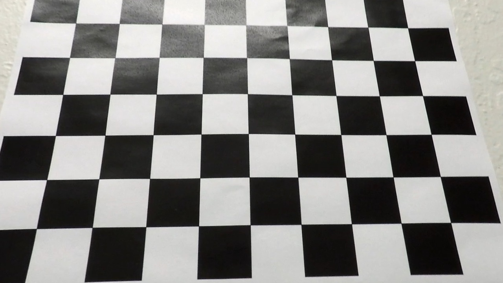

# Advanced Lane Finding
[](http://www.udacity.com/drive)


This project is to write a software pipeline to identify the lane boundaries in a video. It used  camera calibration, color transform, gradient edge detection, perspective tranform, and curvature fitting to find the lane boundary.    

## Project Goal
---

The goals / steps of this project are the following:

* Compute the camera calibration matrix and distortion coefficients given a set of chessboard images.
* Apply a distortion correction to raw images.
* Use color transforms, gradients, etc., to create a thresholded binary image.
* Apply a perspective transform to rectify binary image ("birds-eye view").
* Detect lane pixels and fit to find the lane boundary.
* Determine the curvature of the lane and vehicle position with respect to center.
* Warp the detected lane boundaries back onto the original image.
* Output visual display of the lane boundaries and numerical estimation of lane curvature and vehicle position.

## Files Included
---
* camera_cal/: the images for camera calibration
* test_images/: the images for testing the pipeline on single frames
* output_images/: the images from each stage of the pipeline
* output_videos/: the output videos with marking lane boundaries
* camera_cald/disp_pickle.p: the binary output of camera calibration and perspective transforms
* 01-camcal_and_perspective_transform.ipynb: the processing to calculate the camera calibration matrix and perspective transform matrix
* 02-advance_lane_lines.ipynb: the processing to finding the land lines

## Camera Calibration
---

#### 1. computing the camera matrix and distortion coefficients

The code for this step is contained in the first code cell of the IPython notebook located in "01-camcal_and_perspective_transform.ipynb".  

I start by preparing "object points", which will be the (x, y, z) coordinates of the chessboard corners in the world. Here I am assuming the chessboard is fixed on the (x, y) plane at z=0, such that the object points are the same for each calibration image.  Thus, `objp` is just a replicated array of coordinates, and `objpoints` will be appended with a copy of it every time I successfully detect all chessboard corners in a test image.  `imgpoints` will be appended with the (x, y) pixel position of each of the corners in the image plane with each successful chessboard detection.  

I then used the output `objpoints` and `imgpoints` to compute the camera calibration and distortion coefficients using the `cv2.calibrateCamera()` function.  I applied this distortion correction to the test image using the `cv2.undistort()` function and obtained this result: 

<table border="1">
<tr>
<td></td>
<td></td>
</tr>
<tr>
<td><center>chessboard image</center></td>
<td><center>undistorted image</center></td>
</tr>
</table>

### 2. performed a perspective transform.

The code for my perspective transform includes a function called `warper()` in the file `01-camcal_and_perspective_transform.ipynb`.  The `warper()` function takes as inputs an image (`img`), as well as source (`srcpts`) and destination (`dstpts`) points.  I chose the "test_images/straight_lines1.jpg" as my reference image.  I undistored the the image using the camera calibration parameters got in the last section.  Then the hardcode the source and destination points are in the following manner:

```python
src = np.float32(
    [[273, 672],
     [1030, 672],
     [671, 442],
     [608, 442]])
dst = np.float32(
    [[(img_size[0] / 5), 0],
     [(img_size[0] / 5), img_size[1]],
     [(img_size[0] * 4 / 5), img_size[1]],
     [(img_size[0] * 4 / 5), 0]])
```

This resulted in the following source and destination points:

| Source          | Destination     | 
|:---------------:|:---------------:| 
| (273, 672)      | (256, 720)      | 
| (1030, 672)     | (1024, 720)     |
| (671, 442)      | (1024, 0)       |
| (608, 442)      | (256, 0)        |

I verified that my perspective transform was working as expected by drawing the `srcpts` and `dstpts` points onto a test image and its warped counterpart to verify that the lines appear parallel in the warped image.

The following shows the results:

<table border="1">
<tr>
<td></td>
<td></td>
<td></td>
</tr>
<tr>
<td><center>original image</center></td>
<td><center>undistorted image</center></td>
<td><center>warped image</center></td>
</tr>
</table>
